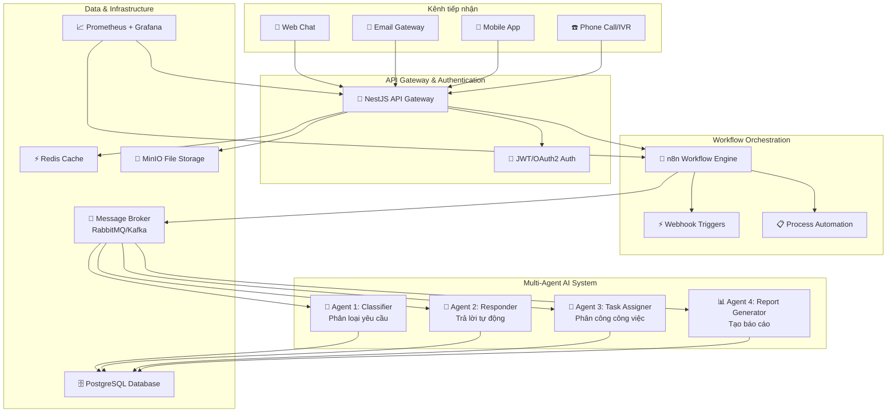

# Hệ thống trợ lý ảo đa tác vụ tự động hóa chăm sóc khách hàng

## 📋 Tổng quan dự án

Hệ thống trợ lý ảo đa tác vụ (Multi-Agent Virtual Assistant) được thiết kế để tự động hóa quy trình chăm sóc khách hàng thông qua việc ứng dụng công nghệ AI và workflow automation. Hệ thống có khả năng xử lý đồng thời nhiều kênh liên lạc khác nhau (email, chat trực tuyến, điện thoại) và tự động phân loại, xử lý, và phản hồi các yêu cầu của khách hàng.

## 🎯 Mục tiêu và lý do phát triển

### Vấn đề hiện tại
- **Khối lượng công việc CSKH ngày càng tăng**: Doanh nghiệp hiện đại phải xử lý hàng trăm yêu cầu khách hàng mỗi ngày qua nhiều kênh khác nhau
- **Thời gian phản hồi chậm**: Nhân viên CSKH phải xử lý thủ công từng yêu cầu, dẫn đến độ trễ cao
- **Thiếu tính nhất quán**: Chất lượng phản hồi phụ thuộc vào kinh nghiệm và tâm trạng của từng nhân viên
- **Chi phí nhân sự cao**: Cần nhiều nhân viên để đảm bảo phục vụ 24/7

### Giải pháp đề xuất
- **Tự động hóa thông minh**: Sử dụng AI để phân loại và trả lời tự động các câu hỏi thường gặp
- **Xử lý đa kênh tập trung**: Tích hợp tất cả kênh liên lạc vào một hệ thống thống nhất
- **Phân công công việc tối ưu**: Tự động phân công yêu cầu phức tạp cho nhân viên phù hợp
- **Báo cáo và phân tích thông minh**: Cung cấp insights để cải thiện chất lượng dịch vụ

## 🏗️ Kiến trúc hệ thống

### Sơ đồ tổng quan



### Thành phần chính

#### 1. **Client Layer (Lớp giao diện)**
- **Web Chat Interface**: Giao diện chat trực tuyến trên website
- **Email Gateway**: Xử lý email thông qua Mailgun/SendGrid
- **Mobile App**: Ứng dụng di động cho khách hàng
- **Phone/IVR System**: Tích hợp với hệ thống điện thoại và IVR

#### 2. **API Gateway (NestJS)**
- Xác thực và phân quyền người dùng
- Quản lý tickets và conversation history
- Cung cấp REST API cho tất cả services
- Rate limiting và security middleware

#### 3. **Workflow Orchestration (n8n)**
- Tự động hóa quy trình xử lý yêu cầu
- Tích hợp với các dịch vụ bên ngoài
- Visual workflow designer
- Event-driven processing

#### 4. **Multi-Agent AI System**
- **Classifier Agent**: Phân loại yêu cầu, xác định mức độ ưu tiên
- **Responder Agent**: Tự động trả lời dựa trên knowledge base
- **Task Assigner Agent**: Phân công công việc cho nhân viên phù hợp
- **Report Generator Agent**: Tạo báo cáo và analytics

#### 5. **Infrastructure Layer**
- **Message Broker**: Đảm bảo xử lý bất đồng bộ và scalability
- **Database**: Lưu trữ dữ liệu tickets, users, conversations
- **Cache**: Tăng tốc độ truy vấn và giảm tải database
- **File Storage**: Lưu trữ attachments và generated reports
- **Monitoring**: Theo dõi performance và health của hệ thống

## 📋 Use Cases chi tiết

### 1. 📧 Email Support Use Case

#### Kịch bản: Khách hàng gửi email khiếu nại về sản phẩm

**Luồng xử lý:**

1. **Nhận yêu cầu**
   - Khách hàng gửi email đến support@company.com
   - Email gateway (Mailgun) forward webhook đến n8n
   - n8n parse email content và attachments

2. **Tạo ticket**
   - n8n gọi API NestJS để tạo ticket mới
   - Lưu thông tin: sender, subject, content, attachments
   - Ticket được gán ID duy nhất và trạng thái "New"

3. **Phân loại tự động**
   - Classifier Agent nhận ticket từ message broker
   - Sử dụng NLP model để phân tích nội dung
   - Kết quả: category="Complaint", priority="High", sentiment="Negative"

4. **Xử lý thông minh**
   - Responder Agent kiểm tra knowledge base
   - Nếu tìm thấy template phù hợp → gửi auto-reply
   - Nếu không → chuyển cho Task Assigner

5. **Phân công công việc**
   - Task Assigner phân tích workload của team
   - Chọn nhân viên có kinh nghiệm xử lý complaints
   - Gửi notification qua Slack/Email

**Kết quả mong đợi:**
- Thời gian phản hồi: < 5 phút cho auto-reply
- Phân loại chính xác: > 90%
- Khách hàng nhận được xác nhận và hướng dẫn ban đầu

### 2. 💬 Live Chat Support Use Case

#### Kịch bản: Khách hàng chat hỏi về tính năng sản phẩm

**Luồng xử lý:**

1. **Kết nối chat**
   - Khách hàng truy cập website và mở chat widget
   - WebSocket connection được thiết lập với NestJS
   - Session được tạo với visitor tracking

2. **Xử lý tin nhắn real-time**
   - Mỗi tin nhắn được gửi qua WebSocket
   - NestJS lưu vào conversation table
   - Tin nhắn được push vào message broker

3. **Phân tích và phản hồi**
   - Classifier Agent phân tích intent (FAQ, Support, Sales)
   - Responder Agent tìm kiếm trong knowledge base
   - Nếu confidence > 80% → trả lời tự động
   - Nếu không → escalate to human agent

4. **Handover to human (nếu cần)**
   - Task Assigner tìm agent online
   - Chuyển context đầy đủ cho human agent
   - Khách hàng được thông báo về sự chuyển đổi

**Kết quả mong đợi:**
- Thời gian phản hồi: < 30 giây
- Tỷ lệ tự động hóa: 60-70% cho câu hỏi thường gặp
- Seamless handover experience

### 3. ☎️ Phone Call Support Use Case

#### Kịch bản: Khách hàng gọi hotline để được hỗ trợ

**Luồng xử lý:**

1. **IVR Processing**
   - Cuộc gọi được định tuyến qua IVR system
   - Speech-to-Text chuyển đổi voice thành text
   - Thông tin được gửi đến n8n workflow

2. **Intent Recognition**
   - Classifier Agent phân tích nội dung cuộc gọi
   - Xác định loại yêu cầu: technical support, billing, sales
   - Tạo ticket với priority dựa trên urgency keywords

3. **Automated Response**
   - Nếu là FAQ → IVR đọc câu trả lời từ knowledge base
   - Text-to-Speech chuyển đổi response thành voice
   - Khách hàng có option để được chuyển sang human agent

4. **Call Routing**
   - Task Assigner kiểm tra availability của agents
   - Route cuộc gọi đến agent có skill phù hợp
   - Cung cấp context từ conversation history

**Kết quả mong đợi:**
- Giảm thời gian chờ: 40-50%
- Tỷ lệ self-service: 30-40%
- Improved first call resolution rate

## 🛠️ Công nghệ và công cụ

### Backend Development
- **NestJS (TypeScript)**: Framework chính cho API Gateway
  - Lý do chọn: Type-safe, modular architecture, built-in dependency injection
- **Node.js**: Runtime environment
- **PostgreSQL**: Primary database cho data persistence
- **Redis**: Caching và session storage
- **RabbitMQ/Apache Kafka**: Message broker cho event-driven architecture

### Workflow Orchestration
- **n8n**: Visual workflow automation platform
  - Lý do chọn: No-code/Low-code, extensive integrations, self-hosted option

### AI/ML Components
- **Python**: Cho AI agents development
- **OpenAI GPT-4/GPT-3.5**: LLM cho natural language processing
- **Hugging Face Transformers**: Pre-trained models cho classification
- **spaCy/NLTK**: Natural language processing libraries
- **scikit-learn**: Machine learning algorithms

### Infrastructure & DevOps
- **Docker**: Containerization
- **Kubernetes**: Container orchestration
- **MinIO**: Object storage cho files và reports
- **Prometheus + Grafana**: Monitoring và metrics
- **GitHub Actions**: CI/CD pipeline

### Frontend (Dashboard)
- **React.js + TypeScript**: Admin dashboard
- **Next.js**: Server-side rendering
- **Tailwind CSS**: UI styling
- **Socket.io**: Real-time communication

### Integration Services
- **Mailgun/SendGrid**: Email processing
- **Twilio**: SMS và voice integration
- **Slack API**: Team notifications
- **Webhooks**: External service integrations

## 📊 Database Schema

### Core Tables

```sql
-- Users table
CREATE TABLE users (
    id UUID PRIMARY KEY DEFAULT gen_random_uuid(),
    email VARCHAR(255) UNIQUE NOT NULL,
    name VARCHAR(255) NOT NULL,
    role VARCHAR(50) NOT NULL,
    created_at TIMESTAMP DEFAULT NOW(),
    updated_at TIMESTAMP DEFAULT NOW()
);

-- Tickets table
CREATE TABLE tickets (
    id UUID PRIMARY KEY DEFAULT gen_random_uuid(),
    source VARCHAR(50) NOT NULL, -- 'email', 'chat', 'phone'
    subject VARCHAR(500),
    content TEXT NOT NULL,
    category VARCHAR(100),
    priority VARCHAR(20) DEFAULT 'medium',
    status VARCHAR(50) DEFAULT 'open',
    assignee_id UUID REFERENCES users(id),
    customer_email VARCHAR(255),
    customer_phone VARCHAR(20),
    metadata JSONB,
    created_at TIMESTAMP DEFAULT NOW(),
    updated_at TIMESTAMP DEFAULT NOW()
);

-- Conversations table
CREATE TABLE conversations (
    id UUID PRIMARY KEY DEFAULT gen_random_uuid(),
    ticket_id UUID REFERENCES tickets(id),
    sender_type VARCHAR(20) NOT NULL, -- 'customer', 'agent', 'system'
    sender_id VARCHAR(255),
    message TEXT NOT NULL,
    metadata JSONB,
    created_at TIMESTAMP DEFAULT NOW()
);

-- Agent logs table
CREATE TABLE agent_logs (
    id UUID PRIMARY KEY DEFAULT gen_random_uuid(),
    agent_name VARCHAR(100) NOT NULL,
    ticket_id UUID REFERENCES tickets(id),
    action VARCHAR(100) NOT NULL,
    input_data JSONB,
    output_data JSONB,
    execution_time_ms INTEGER,
    created_at TIMESTAMP DEFAULT NOW()
);
```

## 🚀 API Endpoints

### Authentication
```http
POST /api/v1/auth/login
POST /api/v1/auth/refresh
POST /api/v1/auth/logout
```

### Tickets Management
```http
GET    /api/v1/tickets              # List tickets with pagination
POST   /api/v1/tickets              # Create new ticket
GET    /api/v1/tickets/:id          # Get ticket details
PATCH  /api/v1/tickets/:id          # Update ticket
DELETE /api/v1/tickets/:id          # Delete ticket
POST   /api/v1/tickets/ingest       # Webhook endpoint for n8n
```

### Conversations
```http
GET  /api/v1/tickets/:id/conversations    # Get conversation history
POST /api/v1/tickets/:id/conversations    # Add new message
```

### Agents
```http
POST /api/v1/agents/:agentId/execute      # Trigger agent execution
GET  /api/v1/agents/logs                  # Get agent execution logs
```

### Reports & Analytics
```http
GET  /api/v1/reports                      # List available reports
POST /api/v1/reports                      # Generate new report
GET  /api/v1/analytics/dashboard          # Dashboard metrics
```

## 📈 Metrics và KPIs

### Performance Metrics
- **Response Time**: Thời gian từ nhận request đến phản hồi đầu tiên
- **Resolution Time**: Thời gian hoàn tất xử lý ticket
- **Throughput**: Số lượng tickets xử lý được mỗi phút
- **System Uptime**: Tỷ lệ thời gian hệ thống hoạt động ổn định

### AI/ML Metrics
- **Classification Accuracy**: Độ chính xác của việc phân loại tickets
- **Confidence Score**: Mức độ tin cậy của AI responses
- **Auto-resolution Rate**: Tỷ lệ tickets được xử lý hoàn toàn tự động
- **False Positive Rate**: Tỷ lệ phân loại sai

### Business Metrics
- **Customer Satisfaction**: Điểm đánh giá từ khách hàng
- **First Contact Resolution**: Tỷ lệ giải quyết ngay lần liên hệ đầu tiên
- **Agent Productivity**: Số tickets xử lý được mỗi agent mỗi giờ
- **Cost Reduction**: Tiết kiệm chi phí so với quy trình thủ công

## ⚙️ Setup và Development

### Prerequisites
```bash
# Install required tools
node.js >= 18.x
python >= 3.9
docker >= 20.x
docker-compose >= 2.x
```

### Quick Start
```bash
# Clone repository
git clone https://github.com/your-username/multi-agent-customer-support.git
cd multi-agent-customer-support

# Setup environment variables
cp .env.example .env
# Edit .env with your configurations

# Start infrastructure services
docker-compose up -d postgres redis rabbitmq minio

# Install dependencies
npm install

# Run database migrations
npm run migration:run

# Start development server
npm run dev
```

### Development Workflow
```bash
# Start all services in development mode
npm run dev:all

# Run tests
npm run test
npm run test:e2e

# Code formatting and linting
npm run lint
npm run format

# Build for production
npm run build
```

## 🏁 Timeline Implementation (12 tuần)

### Giai đoạn 1: Preparation & Design (Tuần 1-2)
- [ ] Nghiên cứu và thiết kế chi tiết hệ thống
- [ ] Chuẩn bị dataset cho training AI models
- [ ] Setup development environment
- [ ] Tạo mockups và wireframes

### Giai đoạn 2: Core Backend Development (Tuần 3-5)
- [ ] Phát triển NestJS API Gateway
- [ ] Thiết kế và implement database schema
- [ ] Authentication và authorization system
- [ ] Basic CRUD operations cho tickets và users

### Giai đoạn 3: Workflow Integration (Tuần 6-7)
- [ ] Setup và configure n8n workflows
- [ ] Tích hợp webhook endpoints
- [ ] Email gateway integration
- [ ] Message broker implementation

### Giai đoạn 4: AI Agents Development (Tuần 8-9)
- [ ] Develop Classifier Agent với ML models
- [ ] Implement Responder Agent với knowledge base
- [ ] Train và fine-tune models với domain-specific data
- [ ] Testing và validation của AI components

### Giai đoạn 5: Advanced Features (Tuần 10)
- [ ] Task Assigner Agent với intelligent routing
- [ ] Report Generator Agent với automated analytics
- [ ] Chat interface và real-time communication
- [ ] Phone/IVR integration (nếu có thời gian)

### Giai đoạn 6: Testing & Optimization (Tuần 11)
- [ ] Unit testing và integration testing
- [ ] Performance testing và optimization
- [ ] Security testing và vulnerability assessment
- [ ] User acceptance testing

### Giai đoạn 7: Documentation & Deployment (Tuần 12)
- [ ] Hoàn thiện documentation
- [ ] Deployment lên cloud platform
- [ ] Chuẩn bị demo scenarios
- [ ] Viết báo cáo luận văn

## 🎯 Demo Scenarios

### Demo 1: Email Processing Flow
1. Gửi 3 emails với nội dung khác nhau:
   - Khiếu nại về sản phẩm lỗi
   - Hỏi về giá và tính năng
   - Yêu cầu hoàn trả
2. Hiển thị real-time processing trong n8n dashboard
3. Show kết quả classification và auto-responses
4. Demonstrate Slack notifications cho agents

### Demo 2: Live Chat Integration
1. Khách hàng chat với các câu hỏi FAQ
2. AI bot trả lời tự động với high confidence
3. Escalation sang human agent khi gặp câu hỏi phức tạp
4. Handover process với full context

### Demo 3: Admin Dashboard
1. Overview của ticket statistics
2. Agent performance metrics
3. Real-time monitoring charts
4. Generated reports export

## 📚 Tài liệu tham khảo

### Academic Papers
- "Multi-Agent Systems for Customer Service Automation" (2023)
- "Natural Language Processing in Customer Support" (2022)
- "Workflow Automation in Enterprise Applications" (2023)

### Technical Documentation
- [NestJS Official Documentation](https://nestjs.com/)
- [n8n Workflow Automation](https://n8n.io/docs/)
- [RabbitMQ Message Patterns](https://www.rabbitmq.com/patterns.html)
- [OpenAI API Reference](https://platform.openai.com/docs/)

## 👥 Đóng góp và Support

### Development Team Roles
- **Backend Developer**: NestJS API development, database design
- **AI/ML Engineer**: Agent development, model training và optimization
- **DevOps Engineer**: Infrastructure setup, deployment, monitoring
- **Frontend Developer**: Admin dashboard, chat interface

### Contact Information
- **Sinh viên thực hiện**: [Tên của bạn]
- **Email**: [your-email@example.com]
- **Giáo viên hướng dẫn**: [Tên GVHD]
- **Trường**: [Tên trường đại học]

---

## 📄 License

Dự án này được phát triển cho mục đích học tập và nghiên cứu trong khuôn khổ luận văn tốt nghiệp.

---

*README này được tạo ra để hỗ trợ việc phát triển luận văn về hệ thống trợ lý ảo đa tác vụ tự động hóa CSKH. Mọi feedback và đóng góp đều được hoan nghênh!* 🎓
